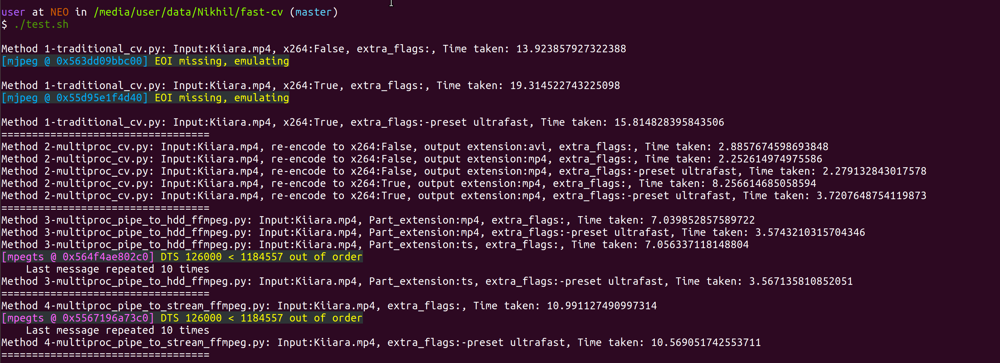
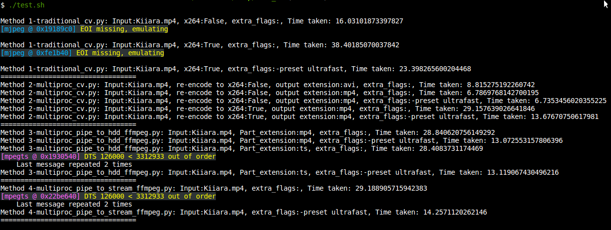

# fast-cv

This repository contains codes that show how video processing in Python can be significantly sped up as well as improved in quality

To run the tests on a video of your choice, run
```bash
./test.sh <video_name>
```

## Files
* `1-traditional_cv.py` - Performs video writing the normal way using OpenCV's `VideoWriter` class
* `2-multiproc_cv.py` - Uses OpenCV's `VideoWriter` class but parallelizes the frames across available CPUs
* `3-multiproc_pipe_to_hdd_ffmpeg.py` - Directly pipes the `numpy` arrays to an ffmpeg writer, allows video writing with modern codecs like `HEVC` and `VP-9`, etc without encoding, decoding from an intermediate codec and then re-encoding it
* `4-multiproc_pipe_to_stream_ffmpeg.py` - Directly stores the parallelized stream in the memory avoiding storage write overhead at the cost of storing the part files in the RAM


## Results

For a simple task like colour separation, we can see a speed up of **6.18x** with 6 cores (on an i7-8700) and **2.35x** (from 16 to 6 seconds on i5-4210U) with 2 cores




## Presentation
The gitpitch presentation also in this repository only covers the methods in `2-multiproc_cv.py`. The files indexed `3-...` and `4-...` combine piping of ffmpeg with the  discussed multiprocessing methods
